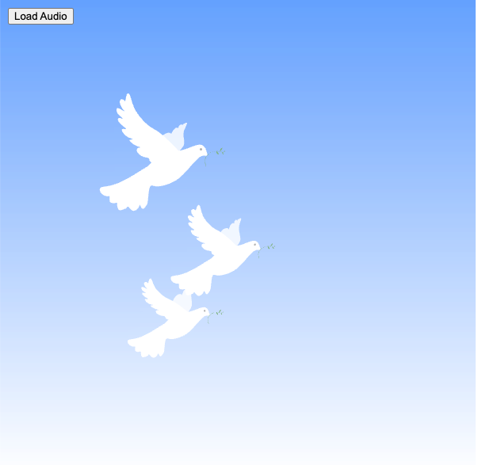

### lwra4681_9103_assigment_2
## IDEA9103-Major-Coding-Assignment- Group Section
The group submission can be found in the folder "group_code_submission" within this repository. Within that folder there is also a document outlining this group work component. 

The Individual component is an extension of the group submission, where I used audio to creat an audio-visual artwork, as detailed below.

## IDEA9103-Major-Coding-Assignment- Individual Section
Dove of Peace/ La Colombe - Interactive Audio-Visual Artwork

### Summary:
La Colombe is an animated artwork inspired by Picasso's "Dove of Peace," enhanced by the emotive music of Le Cygne (The Swan) by Camille Saint-Saëns. This project is built using p5.js with WebGL for 3D rendering and p5.sound for real-time audio analysis, creating an interactive experience where the animation responds dynamically to the music. The result is a harmonious blend of French art and music that reflects universal symbols of peace and hope.

### Features

Audio-Responsive Animation: The movement of the dove’s body and wings, as well as the branches and leaves, synchronizes with the amplitude of the audio track. The audio analysis drives subtle oscillations and rotations, giving the appearance of a dove gliding and breathing to the music.

Multiple Dove Instances: Three instances of the dove are positioned randomly, each scaling, moving, and oscillating uniquely while remaining synchronized with the sound.
Play/Pause Button: Users can control the audio playback, pausing and resuming the audio animation as desired.

### Installation and Setup:

- Download the files and include them in a local development environment.
- Ensure the audio file le-cygne.mp3 is located in the audio_files directory.
- Open index.html in a browser to view and interact with the artwork.

### Controls:

- **Play/Pause Button**: Toggle the audio on or off. The button updates its label to reflect the current state (either "Play Audio" or "Pause Audio").
Core Functions:

-**animateOscillationScaled()**- Applies oscillation and scale to selected parts of the dove model, based on the current amplitude of the audio.
animateRotation() - Rotates the wings of the dove to simulate graceful, wing-like motion.
- **SoundAnalyzer Class** - Analyzes real-time amplitude data from the audio file, which influences the speed and intensity of the animations.

### Audio Analysis and Animation:
The SoundAnalyzer class captures amplitude from Le Cygne, which is mapped to the oscillation and rotation of the dove sketches. The amplitude drives minor positional shifts, simulating the effect of flight and infusing the artwork with lifelike fluidity.

### Technical Details:

- **WebGL and p5.js:** Utilizes WebGL for rendering to achieve 3D-like effects and smooth transitions.
- **p5.sound:** Handles audio playback and real-time analysis, creating a reactive experience that aligns the visuals with the audio.
- **Responsive Scalin** and Positioning: Maintains the aspect ratio of the canvas, adapting to various screen sizes.

### 4 Music:

Le Cygne by Camille Saint-Saëns, performed by Yoyo MA, and Kathryn Stott.

